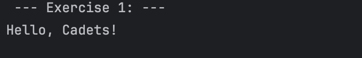
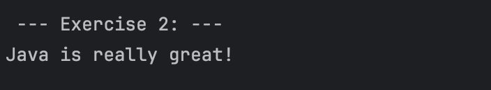
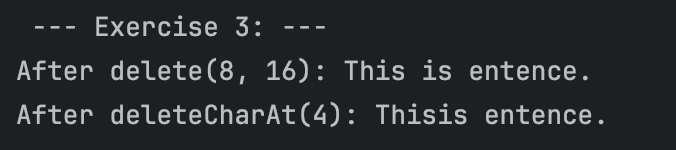
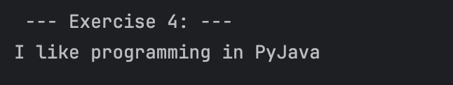
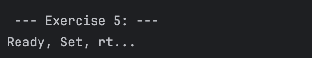
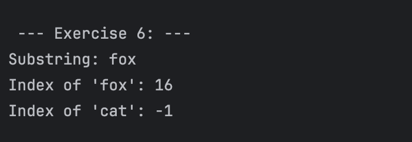
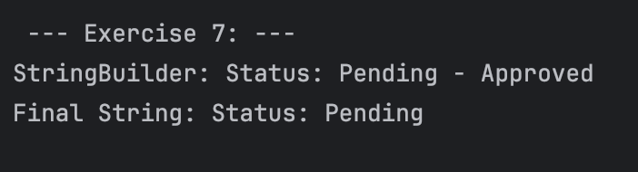

# Hands-on Lab: Exploring Java StringBuilder

---

## Lazaro, Cade Virgil C.

---

### Prediction:
The program will output a string containing "Hello, Cadets".

### Observation:
This happens because we appended the string ", Cadets" to sb1.

---

### Prediction:
The program will be able to output the string "Java is really great!". 

### Observation:
Looking at the output, this happens because we used .insert() on sb2. The offset parameter
use zero indexing, so we will start at 0. Counting from the beginning of the string,
the letter "g" is at index 8, and the program will insert the given string to that index, moving 
the letter "g" forward. 

---

### Prediction:
This program will output "After delete(8, 16): This is entence.". I think it will delete the "a test s"
from the original message. For the second output, it will print "Thisis entence", since index 4 is a whitespace.

### Observation:
My initial prediction on the After delete(8, 16) is correct. This is because .delete()
use zero indexing as well so we just have to count from 0 until we reach the desired
index. Same as for the next output, it will delete the whitespace from "This is entence" and will
print "Thisis entence".

---

### Prediction:
The program will output "I like programming in PyJava".

### Observation:
My prediction is correct, because .replace(start, end) uses zero indexing. However,
for its "end" parameter, it will subtract 1. Index 24 is "t" in "Python" while index 19 is 
the period after the word "Python".

---

### Prediction:
The program will print "Ready, Set, rt...".

### Observation:
This happens because our original message was "Start", then we appended "...", then inserted
"Ready, Set, " at index 0, and finally deleted index 12 to 15-1.

---

### Prediction:
It will print "fox" for its substring, then 16 for its index, and finally, -1 for index
of cat.

### Observation:
The word "fox" is the substring of the original message which ranges from 16 to 19-1. Its
index from the original message is 16. However, the original message does not contain the word
"cat" which in turn will print "-1" when finding its index.

---

### Prediction:
This part of the program will print "Status: Pending - Approved" for its StringBuilder object and
"Status: Pending" for its Final String.

### Observation:
This happens because we appended the word "Pending" to the original message, then we
converted it to a String object. However, after converting, we once again appended the word " - Approved"
to the StringBuilder variable only. This will not affect the Final String variable because Strings are immutable in nature.
